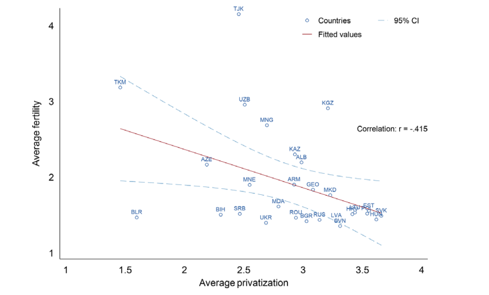
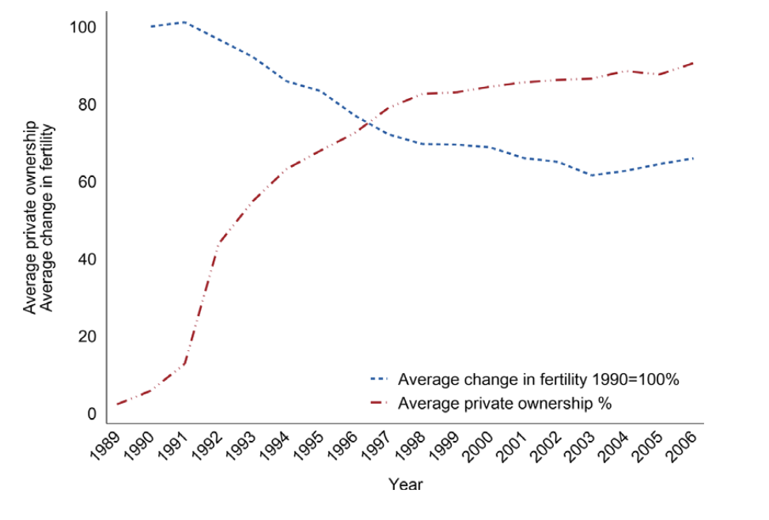

<!--Abstract------------------------------------------------------------------->
## Abstract

**Published in *European Journal of Sociology***

What is the effect of commodification on social reproduction? This paper examines the impact of privatization on fertility, the most fundamental aspect of social reproduction, in post-socialist Central and Eastern Europe. Neoliberal market reforms in post-socialist countries involved the privatization of enterprises and the retrenchment of the welfare state, increasing economic insecurity and eroding the social infrastructure essential for raising families, including access to childcare. While prior studies have pointed to the role of economic insecurity and declining welfare provisions in reducing fertility, this paper is the first to examine the direct effect of privatization on fertility, relying on a political economy approach and a mixed-method research design. At the macro-level, a cross-national panel analysis of 27 post-socialist countries (1989--2006) demonstrates that privatization significantly reduced fertility rates. At the meso-level, a sub-national analysis of 328 Hungarian towns (1990--2001) using two-way fixed effects models reveals that employment in privatized firms reduced local fertility. Both the cross-national and sub-national analyses support a causal interpretation of the relationship between privatization and fertility decline. These findings suggest that the commodification of social life through privatization undermines social reproduction by increasing economic insecurity and weakening public services critical to family formation.

<!--Links---------------------------------------------------------------------->

:::: {.columns}

::: {.column width="33%"}

[ Final Version](https://doi.org/10.1017/S0003975625100246){.btn .btn-outline-primary .btn role="button" data-toggle="tooltip" title="Final Version"}

:::

<!-- ::: {.column width="33%"}

[ Preprint](){.btn .btn-outline-primary .btn role="button" data-toggle="tooltip" title="Preprint"}

::: -->

<!-- ::: {.column width="33%"}

[ Data and Code](){.btn .btn-outline-primary .btn role="button" data-toggle="tooltip" title="Data and Code"}

::: -->

::::

<!--Figures-------------------------------------------------------------------->

## Key Figures

::::: {.column-page}

:::: {.columns}

::: {.column width="50%"}

{width=100%}

:::

::: {.column width="50%"}

{width=100%}

:::

::::

:::::
